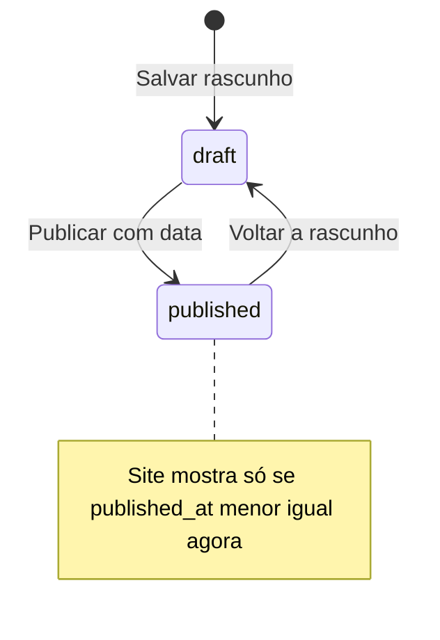
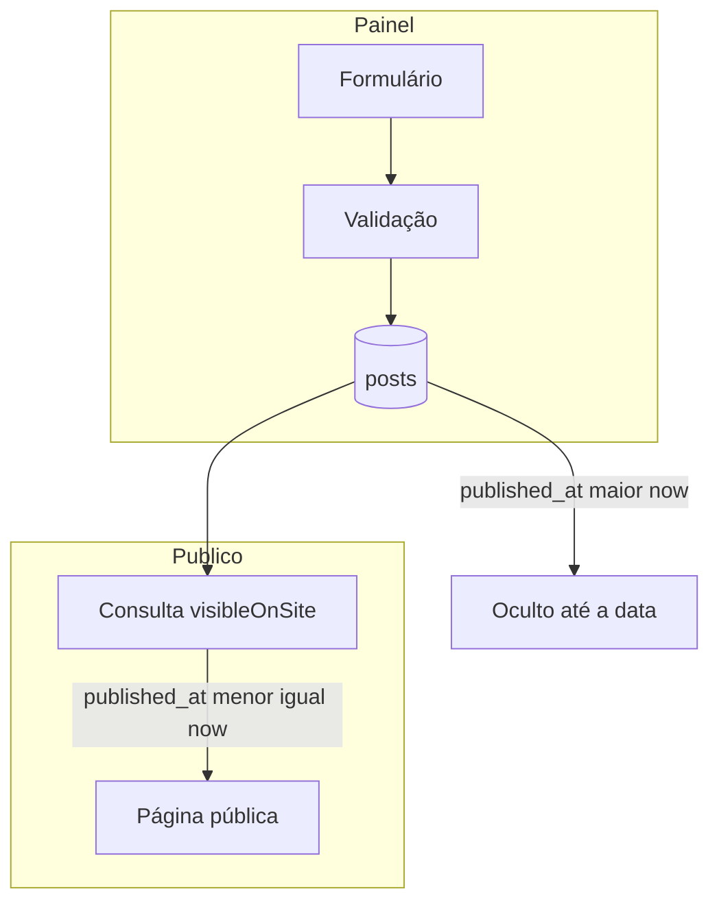

# Posts e publicação

Documentação do fluxo editorial do **Jornal a Borda** após a simplificação para dois status: **Rascunho** e **Publicado**. A visibilidade no site depende da **data/hora de publicação**, sem cron nem worker.

Para visão geral do sistema, veja [sistema.md](./sistema.md).

---

## Índice

1. [Conceitos](#conceitos)
2. [Estados (`draft` e `published`)](#estados-draft-e-published)
3. [Visibilidade no site](#visibilidade-no-site)
4. [Organograma](#organograma)
5. [Painel: criar e editar](#painel-criar-e-editar)
6. [Listagem e filtros](#listagem-e-filtros)
7. [Código relevante](#código-relevante)
8. [Deploy e migração](#deploy-e-migração)
9. [Casos de uso](#casos-de-uso)

---

## Conceitos

| Campo | Função |
|-------|--------|
| `status` | `draft` ou `published` |
| `published_at` | Data/hora em que a matéria **pode** aparecer no site (fuso `config('app.timezone')`) |
| `slug` | URL pública `/{slug}` |

Relacionamentos: autor (`users`), categoria, tags (N:N), comentários.

---

## Estados (`draft` e `published`)

| Status | `published_at` | No site |
|--------|----------------|---------|
| `draft` | `null` (forçado ao salvar) | Não |
| `published` | preenchido, `<= now()` | Sim |
| `published` | preenchido, `> now()` | Não (entra no ar sozinho na hora) |

Não existe mais status `scheduled`. Posts antigos com `scheduled` são convertidos para `published` na migration `2026_05_15_000000_simplify_post_status_to_draft_published`.



---

## Visibilidade no site

Escopo Eloquent `Post::visibleOnSite()`:

- `status = published`
- `published_at` não nulo
- `published_at <= now()`

Usado em home, post, categoria, tag, autor e envio de comentários.

Escopo `Post::publishedAwaitingDate()` (painel):

- `status = published` e `published_at > now()`

Accessors no model: `is_visible_on_site`, `is_awaiting_publication_date`.

---

## Organograma



**Não há** `schedule:run`, `posts:publish-scheduled` nem aba Cron em configurações.

---

## Painel: criar e editar

Rotas: `Admin\PostController` (`store`, `update`), listagem em `AdminPostIndexController`.

**Validação:**

- Status: `draft` ou `published`
- `published`: data e hora obrigatórias (podem ser futuras)
- `draft`: `published_at = null`
- Data futura com `published` é **permitida** (não use mais “Agendado”)

**Formulário:** apenas Rascunho / Publicado. Texto de ajuda: com data futura, a matéria entra no ar na hora marcada.

**Autor:** admin pode escolher outro autor; editor/autor seguem regras de `canManageAllPosts()`.

---

## Listagem e filtros

`GET /painel/posts`

| Parâmetro | Efeito |
|-----------|--------|
| `status` | `draft` ou `published` |
| `visibility` | `live` → no ar; `upcoming` → aguardando data |
| `search`, `category`, `author`, `published_from`, `published_to` | Como antes |

**Estatísticas:** Total, No ar, Aguardando data, Rascunhos.

Badges na tabela: Rascunho / Aguardando data / No ar.

---

## Código relevante

| Arquivo | Papel |
|---------|--------|
| `app/Models/Post.php` | Scopes e accessors |
| `app/Http/Controllers/Admin/PostController.php` | CRUD e validação |
| `app/Http/Controllers/AdminPostIndexController.php` | Listagem |
| `app/Http/Controllers/HomeController.php`, `PostController.php`, etc. | `visibleOnSite()` |
| `database/migrations/2026_05_15_000000_simplify_post_status_to_draft_published.php` | Dados + ENUM MySQL |

---

## Deploy e migração

Em produção, após `git pull`:

```bash
php artisan migrate --force
php artisan optimize:clear
```

A migration:

1. `UPDATE posts SET status = 'published' WHERE status = 'scheduled'`
2. MySQL: `ENUM('draft', 'published')`

Não é necessário cron para publicação por data.

---

## Casos de uso

1. **Publicar agora:** status Publicado, data/hora atual → aparece na home.
2. **Programar:** status Publicado, data/hora futura → painel mostra “Aguardando data”; no site aparece quando `published_at` chegar.
3. **Rascunho:** status Rascunho → nunca no site.
4. **Ex-agendados:** após migrate, continuam `published` com a mesma `published_at`.

---

*Atualizado em maio de 2026.*
