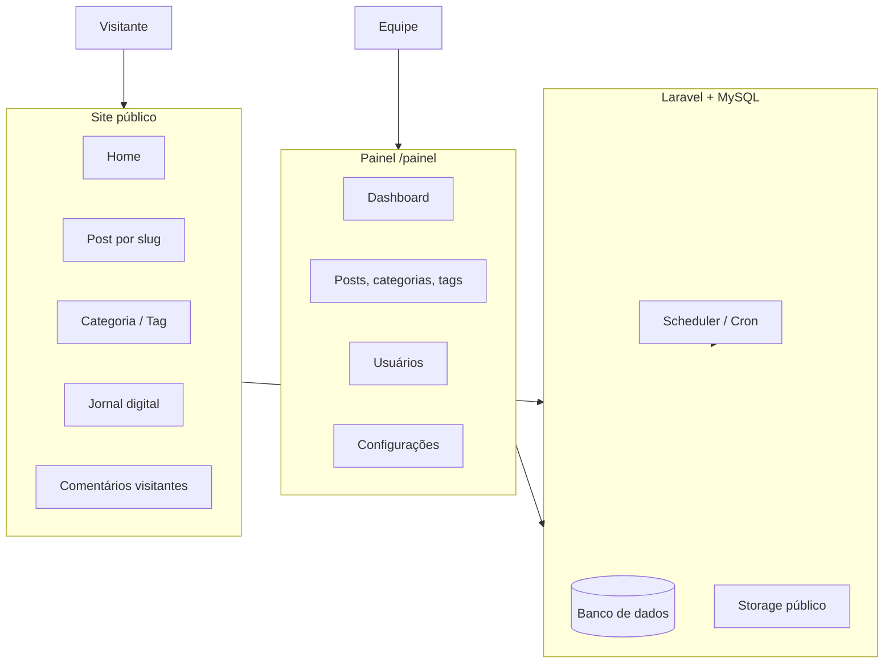
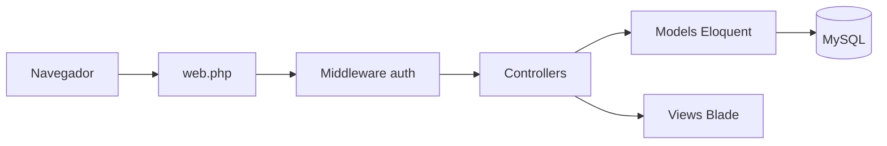
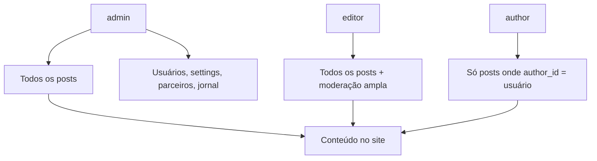
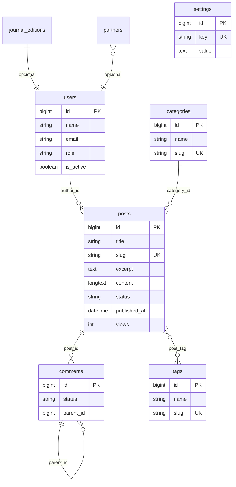

# Jornal a Borda — Documentação do Sistema

Plataforma de blog e portal editorial do **Jornal a Borda** (*A Voz das Periferias de Osasco*), construída em **Laravel 12** (PHP 8.2+) com **MySQL** em produção e suporte a ambiente **Docker** para desenvolvimento local.

---

## Índice

1. [Visão geral](#visão-geral)
2. [Arquitetura](#arquitetura)
3. [Módulos e funcionalidades](#módulos-e-funcionalidades)
4. [Papéis de usuário e permissões](#papéis-de-usuário-e-permissões)
5. [Modelo de dados](#modelo-de-dados)
6. [Rotas principais](#rotas-principais)
7. [Painel administrativo](#painel-administrativo)
8. [Armazenamento e mídia](#armazenamento-e-mídia)
9. [Agendamento e comandos Artisan](#agendamento-e-comandos-artisan)
10. [Ambientes e deploy](#ambientes-e-deploy)
11. [Estrutura de pastas](#estrutura-de-pastas)

---

## Visão geral

O sistema oferece:

| Área | Descrição |
|------|-----------|
| **Site público** | Home, matérias por slug, categorias, tags, página do autor, sobre, equipe, jornal digital (PDF), comentários moderados |
| **Painel (`/painel`)** | CRUD de posts, categorias, tags, comentários, usuários (admin), parceiros, edições do jornal, configurações e upload de imagens (TinyMCE) |
| **Autenticação** | Login tradicional; em ambiente `local`, login rápido por papel para testes |



---

## Arquitetura

Padrão **MVC** do Laravel:

- **Models** (`app/Models/`) — entidades Eloquent e relacionamentos
- **Controllers** — `app/Http/Controllers/` (público) e `app/Http/Controllers/Admin/` (painel)
- **Views** — `resources/views/` (Blade)
- **Rotas** — `routes/web.php`, agendamento em `routes/console.php`



**Stack técnica:**

- PHP 8.2+, Laravel 12
- MySQL 8 (produção / Docker)
- Composer, Vite (assets front-end quando aplicável)
- TinyMCE para edição rica de conteúdo no painel
- Docker Compose: app PHP + MySQL (porta local típica `3098`)

---

## Módulos e funcionalidades

### Posts e editorial

Núcleo do blog: rascunho, publicação com data/hora (incluindo programação futura **sem cron**). Detalhes em **[posts-e-publicacao.md](./posts-e-publicacao.md)**.

### Categorias e tags

- **Categorias**: organização temática; URL `/categoria/{slug}`
- **Tags**: etiquetas transversais; URL `/tag/{slug}`
- Relação **N:N** entre posts e tags (`post_tag`)

### Comentários

- Visitantes enviam comentários em posts publicados (`status` = `pending`)
- Equipe aprova/rejeita no painel (`approved`, etc.)
- Autores veem apenas comentários dos **próprios** posts; admin/editor veem todos

### Usuários e equipe

- Perfis com `role`, bio, avatar, cargo (`position`), flag `is_active`
- Página pública **Nossa equipe** e perfil **Autor** (`/autor/{id}`)
- Gestão de usuários restrita a **admin**

### Jornal digital

- **Edições** em PDF com capa, slug, download
- Rotas: `/jornal-digital`, `/jornal-digital/{slug}`, download
- CRUD apenas para **admin**

### Parceiros

- Logos/links de parceiros (admin)
- Exibição conforme views do site

### Configurações (`settings`)

- Chave-valor em tabela `settings` (grupos: geral, e-mail, etc.)
- Apenas **admin** (site, redes sociais, SMTP)

### Páginas institucionais

- `/sobre-nos`, `/nossa-equipe`

---

## Papéis de usuário e permissões

Três papéis principais (`users.role`):

| Papel | Código | Capacidades resumidas |
|-------|--------|------------------------|
| **Administrador** | `admin` | Tudo: usuários, parceiros, jornal digital, configurações, escolher autor em posts |
| **Editor** | `editor` | Gerencia **todos** os posts, categorias, tags, comentários; não acessa usuários/config/jornal/parceiros |
| **Autor** | `author` | Apenas **próprios** posts e comentários desses posts |

Métodos no model `User`:

- `isAdmin()`, `isEditor()`, `isAuthor()`
- `canManageAllPosts()` → `admin` **ou** `editor`



**Regras de segurança comuns:**

- Rotas do painel exigem middleware `auth`
- Ações sensíveis checam `isAdmin()` ou `canManageAllPosts()` no controller
- Usuário inativo (`is_active = false`) não deve conseguir operar (validar no login conforme implementação)

---

## Modelo de dados

Diagrama simplificado das entidades principais:



**Tabelas de suporte Laravel:** `sessions`, `cache`, `jobs`, `migrations`, etc.

---

## Rotas principais

### Público

| Método | Caminho | Nome | Função |
|--------|---------|------|--------|
| GET | `/` | `home` | Listagem de posts publicados |
| GET | `/{slug}` | `post.show` | Matéria (rota catch-all por último) |
| POST | `/{slug}/comentario` | `post.comment.store` | Novo comentário |
| GET | `/categoria/{slug}` | `category.show` | Posts da categoria |
| GET | `/tag/{slug}` | `tag.show` | Posts da tag |
| GET | `/autor/{id}` | `author.show` | Perfil do autor |
| GET | `/jornal-digital` | `journal-editions.index` | Lista edições |
| GET | `/login` | `login` | Formulário de login |

### Painel (`/painel`, autenticado)

| Prefixo | Recurso |
|---------|---------|
| `/painel` | Dashboard |
| `/painel/posts` | Listagem (`AdminPostIndexController`) + resource CRUD |
| `/painel/categories` | Categorias |
| `/painel/tags` | Tags |
| `/painel/users` | Usuários (admin) |
| `/painel/comentarios` | Moderação |
| `/painel/configuracoes` | Settings (admin) |
| `/painel/partners` | Parceiros (admin) |
| `/painel/journal-editions` | Jornal digital (admin) |
| POST | `/painel/upload-image` | Upload TinyMCE |

---

## Painel administrativo

```mermaid
flowchart TB
    Login[/login] --> Auth{Autenticado?}
    Auth -->|Não| Login
    Auth -->|Sim| Dash[/painel Dashboard]

    Dash --> Posts[Posts]
    Dash --> Cat[Categorias / Tags]
    Dash --> Com[Comentários]
    Dash --> Perfil[Perfil]

    Dash --> AdminOnly{admin?}
    AdminOnly -->|Sim| Users[Usuários]
    AdminOnly -->|Sim| Settings[Configurações]
    AdminOnly -->|Sim| Partners[Parceiros]
    AdminOnly -->|Sim| Journal[Jornal digital]
```

O **dashboard** exibe estatísticas conforme o papel (posts recentes, totais para admin/editor).

---

## Armazenamento e mídia

- Disco `public` do Laravel (`storage/app/public` → link `public/storage`)
- **Imagem destacada** do post: `posts/featured/{uuid}.{ext}`
- **Imagens no corpo** (TinyMCE): endpoint `admin.upload.image`
- URLs geradas via `Storage::disk('public')->url(...)`

Em produção é necessário `php artisan storage:link` se ainda não existir.

---

## Publicação de posts (sem cron)

Posts usam apenas `draft` e `published`. O site exibe matérias com `status = published` e `published_at <= now()`. Data futura com status publicado não exige worker nem `schedule:run`.

Ver [posts-e-publicacao.md](./posts-e-publicacao.md).

---

## Ambientes e deploy

### Desenvolvimento (Docker)

```bash
make up          # Sobe containers
make install     # composer install
make migrate     # Migrations
```

- App: `http://localhost:3098`
- MySQL host: `localhost:3309` (conforme `Makefile`)

### Produção

- Código em `public_html` (document root apontando para `public/`)
- Fluxo típico: `git pull` → `composer install --no-dev` (se aplicável) → `php artisan migrate --force` → `deploy.sh` (limpa caches)

**Problemas comuns em produção:**

1. Migration `tags` duplicada → registrar migration em `migrations` se a tabela já existir
2. Posts com data futura não aparecem até a hora — comportamento esperado; no painel use filtro “Aguardando data”

---

## Estrutura de pastas

```
app/
├── Http/Controllers/     # Público + Admin
├── Models/               # Post (scopes visibleOnSite), User, Category, ...

database/
├── migrations/
└── seeders/

resources/views/
├── admin/                # Painel
├── layouts/
└── *.blade.php           # Páginas públicas

routes/
├── web.php
└── console.php

public/                   # Document root
docs/                     # Esta documentação
```

---

## Documentação relacionada

- **[posts-e-publicacao.md](./posts-e-publicacao.md)** — Ciclo de vida dos posts, status, agendamento, visibilidade no site e fluxos detalhados.

---

*Última atualização: abril de 2026 — alinhada ao código do repositório `blog-jornal-a-borda`.*
